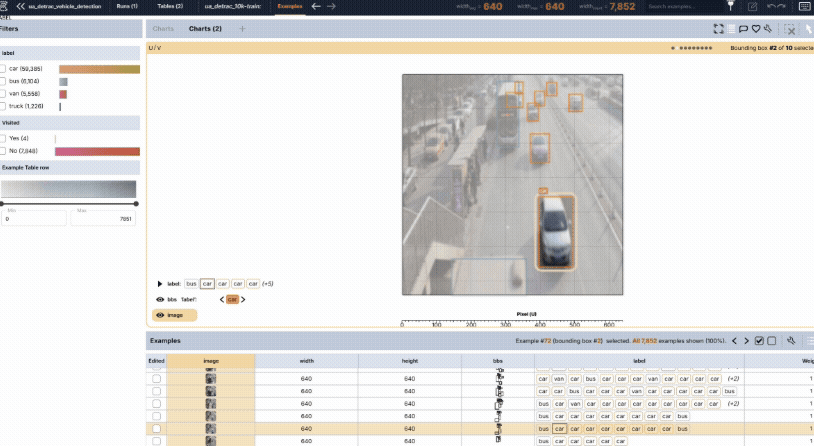
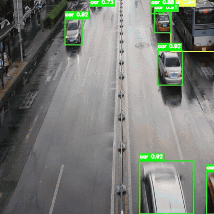

# Data-Centric Multi-Vehicle Detection with Knowledge Distillation

[]()
[]()
[]()
[]()

This project addresses a real-world object detection problem from the Kaggle
*[Multi-Vehicle Detection Challenge](https://www.kaggle.com/competitions/3-lc-multi-vehicle-detection-challenge)*,
focusing not just on model performance but on **data quality, annotation noise, and scalable training strategies**.

It combines:

- Data-centric debugging using the 3LC platform
- Knowledge distillation (Co-DETR → YOLOv8)
- **_TODO:_** Lightweight model experimentation (YOLOv5-v26 variants)

---

## Problem Statement

Detect multiple vehicle classes:

- Car
- Truck
- Bus
- Van

**Key challenge:** The dataset contains **noisy and incomplete annotations**, including:

- Missing bounding boxes
- Incorrect labels
- Inconsistent ground truth (even in test data)

---

## Approach

### 1. Data-Centric Pipeline (3LC Platform)

**Used the 3LC platform to:**

- Visualize images, labels, and predictions
- Identify annotation errors
- Iteratively clean and refine the dataset
- Train baseline model (YOLOv8-Nano)
- Run predictions on train/val data
- Compare predictions vs ground truth
- Fix incorrect annotations
- Retrain

**3LC - annotation tooling that closes the loop:**

[3LC](https://3lc.ai) is the data-management layer. Every training run writes metrics and per-image embeddings back into 3LC tables, making annotation review data-driven rather than random:

- **Embedding clusters** surface systematic label errors across similar images at once rather than one by one.
- **Per-sample metrics** (loss, IoU at eval) pinpoint which images the model struggles with most, directing review effort where it has the highest return.
- **Versioned table revisions** mean every correction is auditable and reversible. `train.py` always calls `.latest()`, so corrections are live in the next run with no file management.


**Pipeline**

```
Raw dataset (noisy YOLO labels from Kaggle)
      │
      ▼
Register with 3LC ──► Dashboard: visualise, filter, edit annotations
      │
      ▼
Train YOLOv8n (round N)
      │
      ▼  per-sample metrics + embeddings written back to 3LC
Run trained model on train/val dataset ──► diff against current labels ──► promote high-conf corrections
      │
      ▼
Corrected table revision (picked up automatically via .latest())
      │
      └──► Train round N+1  →  repeat until mAP plateaus
```
**Install the packages:**

```bash
pip install 3lc-ultralytics umap-learn torch PyYAML tqdm opencv-python
```
**3LC setup:**
```bash
# Download dataset from Kaggle and put it in the working directory
python verify_setup.py        # check environment before anything else
3lc login YOUR_API_KEY        # one-time per machine
3lc service                   # open a new terminal and let this run on the background
python register_tables.py     # create 3LC tables (train + val)
python train.py               # train YOLOv8n from scratch
python predict.py             # generate submission.csv
# Upload submission.csv to Kaggle
```
**3LC dashboard preview**


---

### 2. Knowledge Distillation (Teacher-Student)

- **Teacher model:** Co-DETR (ViT backbone)
- **Student model:** YOLOv8-Nano

**Process:**

1. Teacher generates high-quality pseudo-labels
2. Student is trained on refined annotations
3. Reduces manual labeling effort while improving performance

**Why Co-DETR for label correction?**

[Co-DETR](https://arxiv.org/pdf/2211.12860) (Collaborative Hybrid Assignments Training) achieves **66.0 mAP on COCO** - the current state of the art in object detection. Running it over the training set and diffing its predictions against existing labels gives a principled signal for where annotation quality is weakest:

- **Missed detections** - high-confidence Co-DETR boxes with no matching ground-truth are promoted directly as new annotations.
- **Class corrections** - disagreements on class assignment (e.g. Co-DETR predicts `truck`, label says `van`) are flagged for human review in the 3LC Dashboard.
- **Boundary tightening** - significant IoU gap between Co-DETR and the current box indicates a loose or misaligned label.

The effect is asymmetric: Co-DETR at 66 mAP handles the easy 80% of corrections automatically. Human review time is reserved for genuinely ambiguous cases - occluded vehicles, unusual viewpoints, class boundaries  where expert judgement is irreplaceable.

**Pipeline (Teacher-Student Distillation)**

```
Raw dataset (noisy YOLO labels from Kaggle)
        │
        ▼
Train / Load Teacher Model (Co-DETR, ViT backbone)
        │
        ▼
Generate pseudo-labels (high-confidence predictions)
        │
        ▼
Filter pseudo-labels (confidence + IoU thresholds)
        │
        ▼
Merge with original labels
(remove incorrect boxes, add missing ones)
        │
        ▼
Create refined dataset
        │
        ▼
Train Student Model (YOLOv8-Nano)
        │
        ▼
Evaluate (mAP, precision, recall)
        │
        ▼
(Optional) Iterate with improved teacher / thresholds
```
> Approach 2 is preferred over Approach 1 as it produces higher-quality annotations through knowledge distillation, while also enabling a faster and more scalable training process.

**Yolov8-nano metrics and prediction**

| Metric             | Value |
|--------------------|-------|
| mAP (Kaggle Test)  | ~0.75 |
| Estimated True mAP | ~0.90 |



**PyTorch Inference**

```shell
python inference_pytorch.py --weights models/yolov8n_vehicle_detection.pt \
                            --output-dir outputs \
                            --device cuda \
                            --test-dir data/test/images \
                            --imgsz 640
```

**ONNX Inference**

```shell
python inference_onnx.py --weights models/yolov8n_vehicle_detection.onnx \
                            --output-dir outputs \
                            --device cuda \
                            --test-dir data/test/images \
                            --imgsz 640
```

---

## Key Takeaways

- Data quality can outweigh model choice
- Knowledge distillation improves noisy datasets
- Lightweight models benefit from strong teachers

---

## Next Steps

- Evaluate YOLO variants (v5–v26)
- Test on non-CCTV data  
